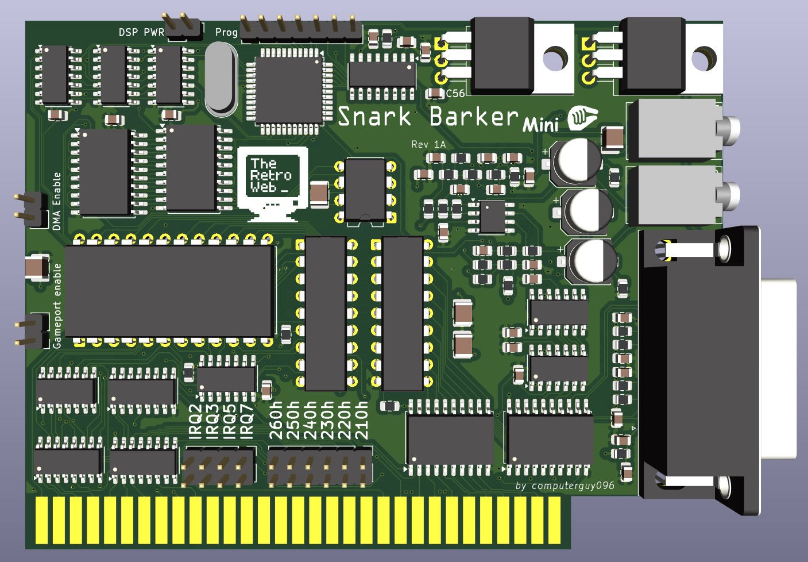
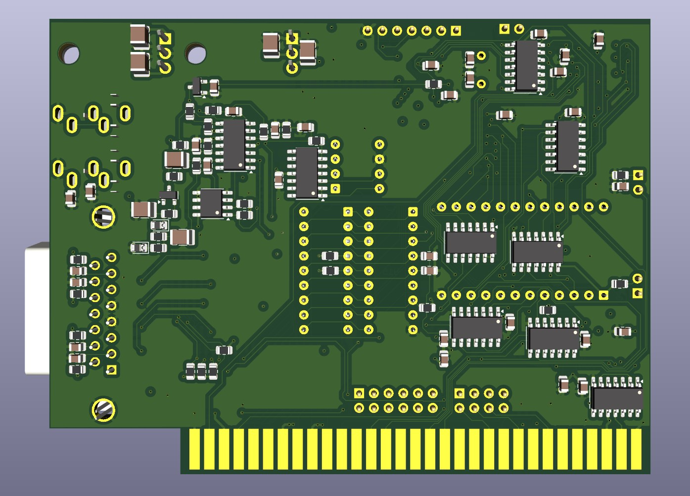

# The Snark Barker Mini - a miniaturized SB 1.0 Clone

The Snark Barker Mini is a function compatible clone of the original [Snark Barker](https://github.com/schlae/snark-barker), made by schlae. It implements all the features of the original Sound Blaster:

- OPL2 FM synth
- digital sound playback and recording
- gameport with MIDI IN/OUT
- SAA1099 (Creative Music System) synth 

The only major difference is the lack of a volume potentiometer. Due to the card's size and parts availability contraints, the volume is pre-set at max output, but this should not be a problem for speaker systems which have adjustable volume.

 

## The Firmware
This card uses an Atmel 89LP51 as a modern day replacement for the original 80C51 microcontroller Creative used to implement the DSP chip. There is a programming header provided for the DSP chip, which can be flashed with [this HEX file](firmware/sb.hex) using the tool of your choice. 

The DSP PWR jumper needs to be installed for normal operation, and removed when programming the DSP (it connects the DSP to VCC).

## Testing and Diagnostics
The card can be tested using schlae's [SBDIAG](utility/SBDIAG.EXE)

